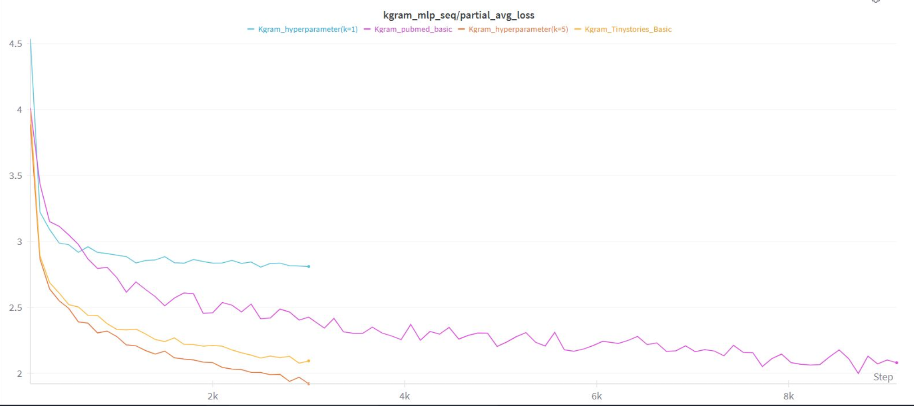
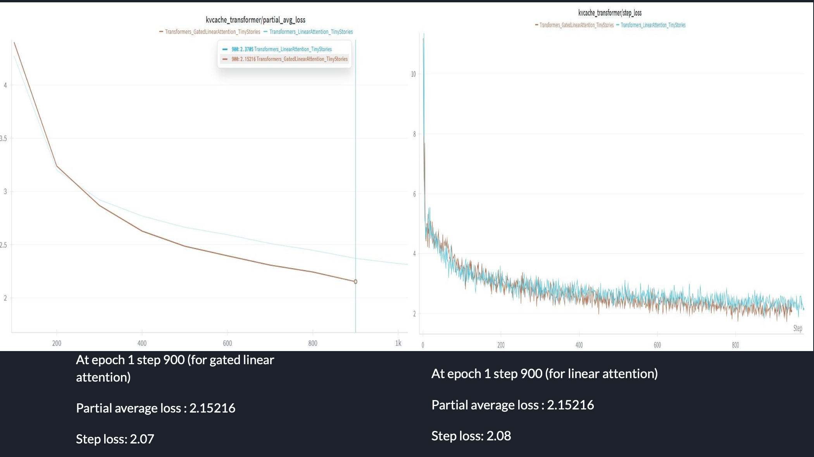
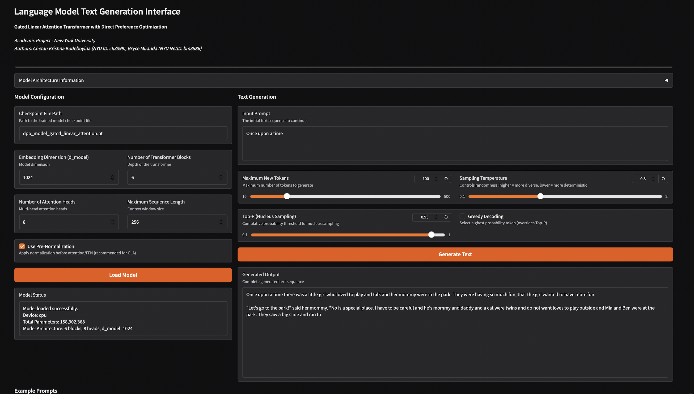

# Language Model Training with Gated Linear Attention and DPO

**Authors:** 
- Chetan Krishna Kodeboyina (NYU ID: ck3399)
- Bryce Miranda (NYU NetID: bm3986)

**Institution:** New York University

This project implements a complete pipeline for training and aligning language models using:
- **Gated Linear Attention (GLA)**: An efficient linear-complexity attention mechanism
- **Direct Preference Optimization (DPO)**: Alignment training without a separate reward model

## Custom Training Data

We experimented with a custom training setup using the
[TinyStories](https://huggingface.co/datasets/roneneldan/TinyStories) dataset. We used the
training split and selected only the story text, excluding any additional metadata.

This choice was motivated by the simplicity and narrative structure of the dataset, which
allowed us to evaluate the model’s ability to learn coherent storytelling and basic
language patterns under limited compute.

## Project Structure

- `gla_model.py`: GLA Transformer model implementation and pretraining script
- `train_dpo.py`: DPO fine-tuning script for preference-based alignment
- `generate.py`: Command-line text generation script
- `web_interface.py`: Interactive web interface for text generation (Gradio)

## Installation

```bash
pip install -r requirements.txt
```

## Pre-trained Weights

To test the model without training from scratch, you can download pre-trained weights from Google Drive:

**Download Link:** [ml_weights folder](https://drive.google.com/drive/folders/1Yj-rZV2K7YTHKCWvE9MK93m5sSUusUDG?usp=share_link)


## Usage

### 1. Pretrain GLA Transformer

```bash
python gla_model.py \
    --hf_dataset roneneldan/TinyStories \
    --num_epochs 3 \
    --batch_size 16 \
    --learning_rate 3e-4 \
    --save_path gla_model.pth
```

### 2. Fine-tune with DPO

```bash
python train_dpo.py \
    --checkpoint gla_model.pth \
    --jsonl_file tinystories_dpo_generated.jsonl \
    --num_epochs 3 \
    --beta 0.1 \
    --learning_rate 1e-6 \
    --save_path dpo_model.pt
```

### 3. Generate Text

**Option A: Interactive Web Interface (Recommended)**

```bash
python web_interface.py
```

Then open your browser to `http://localhost:7860` for an interactive interface!

**Option B: Command Line**

```bash
python generate.py \
    --load_path dpo_model.pt \
    --prompt "Once upon a time" \
    --max_new_tokens 100 \
    --top_p 0.95 \
    --block_size 256 \
    --n_blocks 6
```

## Key Features

- **Gated Linear Attention**: Linear complexity attention with learned gates
- **DPO Training**: Preference alignment without reward models
- **Efficient Generation**: KV caching for fast inference
- **Modern Architecture**: RMSNorm, SwiGLU, pre-normalization

## Model Architecture

- Embedding dimension: 1024 (configurable)
- Attention heads: 8 (configurable)
- Transformer blocks: 6 (configurable)
- Sequence length: 1024 tokens (configurable)

## Results and Observations

Training Stability and Convergence



Training loss curves demonstrate stable convergence across standard Transformer, Linear Attention, and Gated Linear Attention models.
Both linear-complexity attention variants converge smoothly, with Gated Linear Attention achieving marginally lower step-wise loss at equivalent training steps. This suggests that the learned gating mechanism improves memory retention during training.

Comparison: Linear vs Gated Linear Attention



Direct comparison at identical epochs and steps shows that Gated Linear Attention consistently matches or slightly improves upon Linear Attention loss values, while maintaining the same O(N) computational complexity.
This indicates that gating provides better control over historical context without introducing additional computational overhead.

Efficiency and Inference Behavior

Unlike standard Transformers that rely on a growing KV cache during autoregressive generation, Linear and Gated Linear Attention maintain constant memory usage during inference.
This makes them more suitable for long-context generation and resource-constrained environments.

Effect of DPO Fine-Tuning
After DPO fine-tuning, the model produces outputs with:
Reduced repetition
Improved coherence
Better alignment with preferred responses

Notably, these improvements are achieved without training a separate reward model, demonstrating the practicality of DPO for alignment in smaller-scale systems.

Qualitative Generation Results

Sample generations highlight clear qualitative differences:
Standard Transformer: Fragmented outputs with higher repetition
Linear Attention: Improved coherence but occasional loss of long-range structure
Gated Linear Attention: Smoother narrative flow and better continuity
These results suggest that gating helps preserve relevant context over longer generations while retaining the efficiency benefits of linear attention.

## Web-Based Text Generation Interface



To facilitate qualitative evaluation and easy interaction with the trained models, we built
a web-based text generation interface using Gradio. The interface allows users to load trained
checkpoints, adjust model and sampling parameters, and generate text interactively.

## What We Learned

This project helped us understand the practical trade-offs in modern language model design.

- We saw that attention efficiency becomes critical under limited compute. Linear attention enables longer-context modeling without the quadratic memory cost of standard Transformers, making experimentation more feasible.

- Adding gating to linear attention improved training stability and generation quality by helping the model decide what past information to retain. We also found that normalization choices matter—using RMSNorm with pre-normalization significantly improved optimization stability.

- Through DPO fine-tuning, we learned that alignment does not require complex RL pipelines. Direct Preference Optimization provided a simple and effective way to improve output quality without training a separate reward model.

Overall, this work reinforced that small-scale experiments can still yield meaningful insights when architectural choices are carefully evaluated.

## Limitations and Future Improvements

- This work was limited by compute and dataset scale. Training larger models on more diverse data would help validate the results more strongly.
Evaluation focused mainly on loss trends and qualitative outputs. Future work could include quantitative metrics such as perplexity and human evaluation.

- While linear and gated attention are designed for long contexts, extremely long sequence lengths were not extensively tested. Additionally, higher-quality preference data could further improve DPO alignment.

Future efforts could also focus on optimizing inference speed and memory usage for real-world applications.

## Individual Contributions

**Chetan Krishna Kodeboyina**

- Implemented the Gated Linear Attention architecture and training pipeline.
- Ran pretraining experiments on TinyStories.
- Built the text generation pipeline and Gradio-based interface.

**Bryce Miranda**

- Implemented DPO fine-tuning for alignment.
- Prepared preference data and evaluated model outputs.
- Contributed to experimental analysis and documentation.
